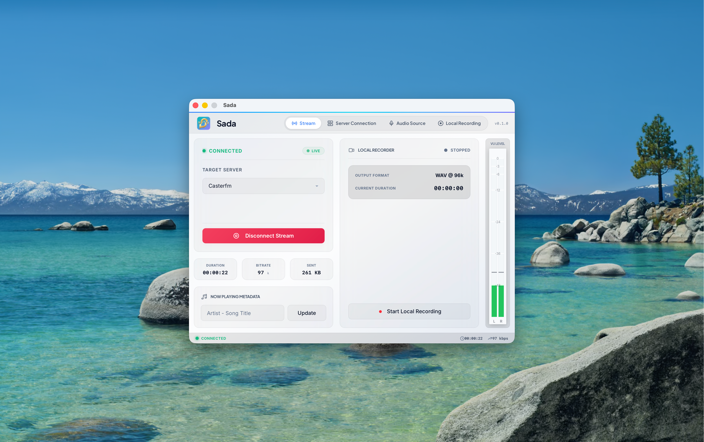

# Sada — Real-Time Live Audio Broadcaster
> From arabic word (صدى) meaning Echo. Is a high-performance, ultra-low latency, cross-platform audio streaming desktop engine. Capture live audio from any device and stream it in real-time to Icecast or Shoutcast servers with robust lock-free pipelines.

---



## 🚀 Key Features

*   **Zero-Latency Audio Pipeline**: Unidirectional, lock-free 3-stage thread architecture using single-producer single-consumer (SPSC) ring buffers. No garbage-collector pauses.
*   **Active Settings Safeguards**: Automatic configuration locking while "On Air" to prevent mid-stream hardware or network changes, paired with glowing alert indicators.
*   **Instant Metadata Connect Hooks**: Automative "Now Playing" metadata updates pushed instantly upon successful server connection.
*   **Dual Stream Modes**: Full support for preferred Icecast (HTTP PUT) and legacy Shoutcast (ICY) server connection streams.
*   **Premium Codec Suite**: Built-in support for **MP3**, **Opus**, **AAC (AAC-LC)**, **HE-AAC (AAC+ / AAC Plus)**, and **Ogg Vorbis** — all statically linked.
*   **Premium Dark UI**: Built with a state-of-the-art dark glassmorphism interface featuring smooth micro-animations, real-time responsive VU meters, and clean configuration panels.

---

## 🛠️ Tech Stack

*   **Backend**: **Rust** — Ensures high-performance, deterministic memory safety, and thread-level priority allocation.
*   **Frontend**: **Svelte 5** — Utilizes deep signals (`$state`, `$derived`, `$effect`) for instant UI response and seamless state synchronization.
*   **Shell**: **Tauri 2.0** — Fast, memory-efficient native OS webview container, avoiding Electron bloat.
*   **Audio Capture**: **cpal** — Handles low-level multi-platform driver binding.

---

## 🎙️ Supported Audio Codecs

Sada features a highly versatile, broadcast-grade audio codec pipeline. To ensure the compiled installers are fully self-contained, **all audio codecs are compiled directly from source and statically linked** into the final native bundle, guaranteeing zero dynamic runtime system library dependencies.

| Codec | Broadcast Standard | Ideal Bitrate | Streaming Protocol | Core Use Case |
| :--- | :--- | :--- | :--- | :--- |
| **AAC (AAC-LC)** | Advanced Audio Coding | 96 - 320 kbps | Icecast / Shoutcast | Gold standard for high-fidelity music and spoken word. |
| **HE-AAC (AAC+ / HE-AAC v1)** | High-Efficiency AAC | 32 - 64 kbps | Icecast / Shoutcast | Low-bitrate powerhouse combining AAC with Spectral Band Replication (SBR). |
| **Opus** | IETF RFC 6716 | 64 - 192 kbps | Icecast | Extreme quality, low-latency conversational and music streaming at 48.0 kHz. |
| **MP3** | MPEG-1 Audio Layer III | 128 - 320 kbps | Icecast / Shoutcast | Universal legacy compatibility with all older web receivers and players. |
| **OGG Vorbis** | Xiph.Org Ogg Vorbis | 96 - 256 kbps | Icecast | Robust open-source, patent-free streaming container. |

---

## 📦 Third-Party Native Dependencies

Since **Sada** uses high-performance C bindings for audio codecs (`lame` for MP3, `opus` for Opus, `libvorbis` for Ogg Vorbis, and `fdk-aac` for AAC/HE-AAC), you **MUST** install these third-party library prerequisites on your operating system prior to compiling the application.

Choose your platform below to set up your build environment:

### 🍏 macOS (CoreAudio)

Ensure you have **Homebrew** installed. Run the following command to download the required audio libraries:

```bash
brew update
brew install lame opus libvorbis fdk-aac pkg-config
```

> [!NOTE]
> Ensure the **Xcode Command Line Tools** are installed by running `xcode-select --install`.

---

### 🐧 Linux (Debian / Ubuntu / Arch)

You need the ALSA development headers (for `cpal` audio capture) alongside the developer headers for each audio codec and standard Tauri system packages.

#### **Debian / Ubuntu (apt)**
```bash
sudo apt-get update
sudo apt-get install -y \
  build-essential \
  pkg-config \
  libasound2-dev \
  libmp3lame-dev \
  libopus-dev \
  libvorbis-dev \
  libfdk-aac-dev \
  libgtk-3-dev \
  webkit2gtk-4.1 \
  libssl-dev \
  libayatana-appindicator3-dev \
  librsvg2-dev
```

#### **Arch Linux (pacman)**
```bash
sudo pacman -Syu
sudo pacman -S \
  base-devel \
  pkgconf \
  alsa-lib \
  lame \
  opus \
  libvorbis \
  fdk-aac \
  gtk3 \
  webkit2gtk-4.1 \
  openssl \
  libayatana-appindicator \
  librsvg
```

---

###  Windows (WASAPI)

Windows utilizes the Microsoft C Runtime (MSVC) toolchain. The recommended way to manage native C dependencies in Rust under Windows is through **vcpkg**.

1.  **Clone and Bootstrap vcpkg**:
    Open PowerShell or Command Prompt:
    ```powershell
    git clone https://github.com/microsoft/vcpkg.git
    cd vcpkg
    .\bootstrap-vcpkg.bat
    ```

2.  **Install Audio Libraries**:
    Install the 64-bit static-link versions matching your Rust toolchain:
    ```powershell
    .\vcpkg.exe install mp3lame:x64-windows opus:x64-windows libvorbis:x64-windows fdk-aac:x64-windows
    ```

3.  **Configure Environment Variables**:
    Set `VCPKG_ROOT` in your system environment variables to the path of your cloned `vcpkg` directory.
    Enable dynamic linking for Cargo by setting:
    ```powershell
    [System.Environment]::SetEnvironmentVariable('VCPKGRS_DYNAMIC', '1', 'User')
    ```

4.  **Install Tauri Prerequisites**:
    Ensure you have the **Microsoft C++ Build Tools** installed (via Visual Studio Installer with the "Desktop development with C++" workload) and **WebView2 Runtime**.

---

## 🔒 Operating System Privacy & Permissions

To capture and monitor audio from your physical input devices (e.g. microphones, soundcards, audio interfaces), **Sada** requires system-level hardware permissions.

### 🍏 macOS (CoreAudio)
*   **Automatic Prompts**: macOS requires applications to declare the `NSMicrophoneUsageDescription` entitlement in their bundle. Sada includes this natively, causing macOS to display a permission request dialog on startup.
*   **Troubleshooting**: If the VU meter remains completely silent, check **System Settings > Privacy & Security > Microphone** and ensure that **Sada** is enabled.

### 🏁 Windows (WASAPI)
*   **Desktop Application Access**: Windows does not use code-level manifest prompts for native Win32/Tauri desktop apps. Instead, access is governed globally.
*   **Privacy Access**: Ensure microphone permission is allowed globally: Go to **Settings > Privacy & Security > Microphone**, toggle on **Microphone access**, and verify that **Let desktop apps access your microphone** is toggled **On**.

### 🐧 Linux (ALSA / PulseAudio / PipeWire)
*   **User Audio Group**: Linux handles hardware devices via system groups. The active user account must be part of the `audio` group to capture PCM frames directly from ALSA or PulseAudio:
    ```bash
    sudo usermod -aG audio $USER
    ```
    *(Log out and log back in for group changes to take effect).*
*   **Sandbox Container Permissions**: If you run or build Sada inside sandbox container environments:
    *   **Flatpak**: Grant PulseAudio/PipeWire sockets: `--socket=pulseaudio` or `--filesystem=xdg-run/pipewire-0`.
    *   **Snap**: Connect the audio recording interface plug: `snap connect sada:audio-record`.

---

## 🚀 Developer Quickstart

Once your native dependencies are installed, you can build and run **Sada** locally:

### 1. Install Node Dependencies
```bash
npm install
```

### 2. Run in Development Mode
Starts the Svelte 5 hot-reloader and launches the Tauri desktop application with debug consoles:
```bash
make dev
```
*(Or run `npm run tauri dev`)*

### 3. Run Build Checks
Run Rust and Svelte type and compiler checks to ensure clean builds:
```bash
make check
```

### 4. Build Production Installers
To compile optimized native binaries and create production installers (dmg, deb, msi/exe) for your current platform:
```bash
make build
```
*(Or run `npm run tauri build`)*

---

## 🗂️ Project Directory Map

```
sada/
├── src/                      # Svelte 5 Frontend
│   ├── App.svelte            # Main view, reactive coordinator, and footer
│   ├── components/           # UI settings panels and layout structures
│   ├── lib/                  # TypeScript IPC Tauri event listeners
│   └── app.css               # Premium design system tokens
├── src-tauri/                # Tauri Rust Backend
│   ├── Cargo.toml            # Codecs and low-latency audio dependencies
│   ├── tauri.conf.json       # App manifests and secure entitlements
│   └── src/
│       ├── audio/            # cpal capture stream, VU rms, and encoder traits
│       ├── streaming/        # Raw Icecast PUT TCP socket handshake
│       ├── commands.rs       # Tauri IPC commands
│       └── lib.rs            # Application builder and run engine
├── Makefile                  # Premium cross-platform build commands
└── README.md                 # Project handbook
```

---

## 📄 License

This project is licensed under the MIT License.
